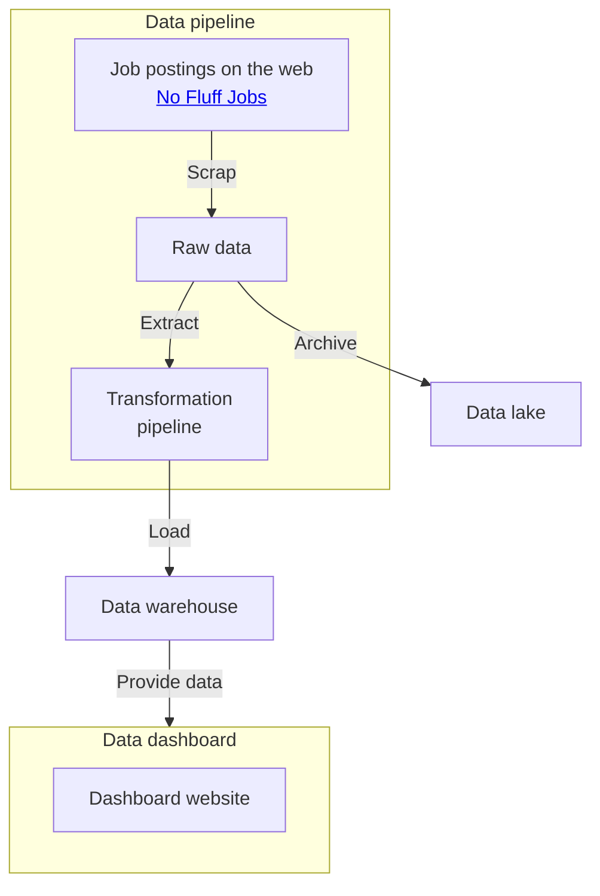

# IT Jobs Meta

Data pipeline and meta-analysis dashboard for IT job postings from the web.

This application serves as a data analysis service based on postings from [No Fluff Jobs](https://nofluffjobs.com), which is one of the most popular job walls for IT specialists in Poland. The data is gathered once a week and presented in a dashboard in form of interactive plots, graphs, and maps. The meta-analysis of IT markets provides insights into leading technologies, salaries, job experience, and work locations distributions. The knowledge distilled from the analysis can help with finding a job, evaluating salary for a vacancy, or planning a career in the IT sector. Have fun exploring the data!

## Methodology and project structure

The idea behind data analysis is described in the data_exploration Jupyter Notebook in the `analysis` directory.

The application 


## Layout



## Setup

At least Python 3.10 is required to run this application.

### Installation

To install the application system-wide obtain a PEP517 compatible build tool. E.g. this can be done with [build](https://github.com/pypa/build) inside the project directory:

```sh
pip install build
python -m build
pip install dist/it_jobs_meta*.whl
```

This will install the application alongside all dependencies. From now you should be able to call it with `it-jobs-meta` (if it doesn't work double check pip installation path and `PATH` environmental variable).

The application can also be used without installation, in an development setup. Refer to further sections of this file for advice on that.

## Usage

Resort to the command line help to discover available options:

```
$ it_jobs_meta -h
usage: it-jobs-meta [-h] [-l LOG_PATH] {pipeline,dashboard} ...

Data pipeline and meta-analysis dashboard for IT job postings

positional arguments:
  {pipeline,dashboard}

options:
  -h, --help            show this help message and exit
  -l LOG_PATH, --log-path LOG_PATH
                        path to the log file (default: var/it_jobs_meta.log)
```

The `pipeline` subcommand is used to scrap the job postings data from the web, store it in *data lake* in a raw form, and in *data warehouse* in a processed form (ready to be used by the dashboard later).

```
$ it_jobs_meta -h
usage: it-jobs-meta pipeline [-h] [-c CRON_EXPRESSION] (-r CONFIG_PATH | -b CONFIG_PATH) (-m CONFIG_PATH | -s CONFIG_PATH)

options:
  -h, --help            show this help message and exit
  -c CRON_EXPRESSION, --schedule CRON_EXPRESSION
  -r CONFIG_PATH, --redis CONFIG_PATH
  -b CONFIG_PATH, --s3-bucket CONFIG_PATH
  -m CONFIG_PATH, --mongodb CONFIG_PATH
  -s CONFIG_PATH, --sql CONFIG_PATH
```

There are several backend implementations for the data lake and data warehouse. It is preffared to use Redis for development and AWS S3 bucket in deployment. Preprocessed data can be stored either as NoSQL with MongDB or SQL with MariaDB.

The `dashboard` subcommand is used to run the dashboard server; use it to visualize the data after the data is scrapped with the `pipeline` subcommand.
```
$ it_jobs_meta -h
usage: it-jobs-meta dashboard [-h] [-w] -m CONFIG_PATH

options:
  -h, --help            show this help message and exit
  -w, --with-wsgi
  -m CONFIG_PATH, --mongodb CONFIG_PATH
```

The dashboard supports only the MongoDB database as data source.


> 📝 Notice: if you don't want to store the log output in a file redirect it to `/dev/null` (e.g. `it-jobs-meta -l /dev/null ...`)

## Development

You can run the program without installing it with package manager. Install the prerequisites with `pip install -r requirements.txt` (using virtual environment is recommended). To install extra development tools compatible with the project (test tools, type checker, etc.) run: `pip install -r requirements-dev.txt`.

The server-side services for development can be set up with docker compose. Install docker, docker-compose and run `docker-compose up` in the project directory to setup the services.

You can run the application with `python -m it_jobs_meta`. Since running the data pipeline is going to download data from the web, it is not recommended to run it as a whole during development. Some modules include demo versions of parts of the application, resort to using them and unit tests during the development process.

### Development tools

The development tools packages are stored in `requirements-dev.txt`. To run unit tests type: `pytest it_jobs_meta`, to lint: `flake8 it_jobs_meta`, to type check: `mypy it_jobs_meta`, to sort imports: `isort it_jobs_meta`, to format the code: `black it_jobs_meta`.


## Deployment

The application is not bound to any specific deployment environment; however, AWS is used for running the main instance.

The setup for creating AWS infrastructure for the application using terraform is placed int the `deployment` directory. 

## License

There is no explicit license with this software meaning that the [following](https://choosealicense.com/no-permission/) applies.
