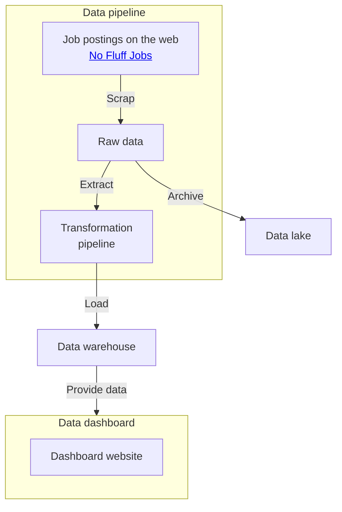

# IT Jobs Meta

[](https://github.com/maciejzj/it-jobs-meta/actions/workflows/quality_checks.yml)

Data pipeline and meta-analysis dashboard for IT job postings from the web.

This application serves as a data analysis service based on postings from [No
Fluff Jobs](https://nofluffjobs.com), which is one of the most popular job walls
for IT specialists in Poland. The data is gathered once a week and presented in
a dashboard in form of interactive plots, graphs, and maps. The meta-analysis of
IT markets provides insights into leading technologies, salaries, job
experience, and work locations distributions. The knowledge distilled from the
analysis can help with finding a job, evaluating salary for a vacancy, or
planning a career in the IT sector. Have fun exploring the data!

## Methodology and project structure

The idea behind data analysis is described in the `data_exploration.ipynb`
Jupyter Notebook in the `analysis` directory.

The data processing pipeline and application operation scheme follow the
flowchart below:



Notice that the terms *data lake* and *data warehouse* are used in a rather
loose/naive way in the following descriptions.

## Setup

At least Python version 3.10 is required to run this application. The setup
configuration is stored in the `setup.cfg` file.

### Installation

You can install this application with pip, either from a local repository:

```
git clone git@github.com:maciejzj/it-jobs-meta.github
pip install ./it_jobs_meta
```

or directly from the GitHub repository with:

```
pip install git+git@github.com:maciejzj/it-jobs-meta.git
```

All runtime dependencies will be installed alongside the application. From now,
you should be able to call it with `it-jobs-meta` (if it doesn't work double
check pip installation path and `PATH` environmental variable).

The application can also be used without installation, in a development setup.
Refer to further sections of this file for advice on that.

## Usage

Resort to the command line help to discover available options:

```
$ it-jobs-meta -h
usage: it-jobs-meta [-h] [-l LOG_PATH] {pipeline,dashboard} ...

Data pipeline and meta-analysis dashboard for IT job postings

positional arguments:
  {pipeline,dashboard}

options:
  -h, --help            show this help message and exit
  -l LOG_PATH, --log-path LOG_PATH
                        path to the log file (default: var/it_jobs_meta.log)
```

> 📝 **Notice:** If you don't want to store the log output in a file redirect it
> to `/dev/null` (e.g. `it-jobs-meta -l /dev/null ...`)

The `pipeline` subcommand is used to scrap the job postings data from the web,
store it in the *data lake* in a raw form, and in the *data warehouse* in a
processed form (ready to be used by the dashboard later).

```
$ it-jobs-meta -h
usage: it-jobs-meta pipeline [-h] [-c CRON_EXPRESSION] (-r CONFIG_PATH | -b CONFIG_PATH) (-m CONFIG_PATH | -s CONFIG_PATH)

Run data pipeline once or periodically, scrap data, store it in the data lake, load processed data to the data warehouse.

options:
  -h, --help            show this help message and exit
  -c CRON_EXPRESSION, --schedule CRON_EXPRESSION
                        schedule pipeline to run periodically with a cron expression
  -r CONFIG_PATH, --redis CONFIG_PATH
                        choose Redis as the data lake with the given config file
  -b CONFIG_PATH, --s3-bucket CONFIG_PATH
                        choose S3 Bucket as the data lake with given config file
  -m CONFIG_PATH, --mongodb CONFIG_PATH
                        choose MongoDB as the data warehouse with the given config file
  -s CONFIG_PATH, --sql CONFIG_PATH
                        choose MariaDB as the data warehouse with the given config file
```

The `dashboard` subcommand runs the dashboard server; use it to visualize the
data after the data is scrapped with the `pipeline` subcommand.

```
$ it-jobs-meta -h
usage: it-jobs-meta dashboard [-h] [-w] -m CONFIG_PATH

options:
  -h, --help            show this help message and exit
  -w, --with-wsgi       run dashboard server with WSGI (in deployment mode)
  -m CONFIG_PATH, --mongodb CONFIG_PATH
                        choose MongoDb as the data provider with the given config file
```

There are several backend implementations for the data lake and the data
warehouse. It is preferred to use Redis for development and AWS S3 Bucket in
deployment. Preprocessed data can be stored either as NoSQL with MongDB or SQL
with MariaDB. The dashboard supports only the MongoDB database as the data
provider.

## Configuration files

There are several options that require passing a path to a `yaml` config path
as an argument. The reference config files are stored in the `config` directory.

> ❗️ **Warning:** The config files match the services configuration in the
> `docker-compose.yml` file. If you wish to run this app publicly change the
> login credentials.

## Development

You can run the program without installing it with a package manager. Install
the prerequisites with `pip install -r requirements.txt` (using virtual
environment is recommended). To install extra development tools compatible with
the project (test tools, type checker, etc.) run: `pip install -r
requirements-dev.txt`.

The server-side services for development can be set up with Docker Compose.
Install docker, docker-compose, and run `docker-compose up` in the project
directory to set up the services.

The application can be run with `python -m it_jobs_meta`. Since running the data
pipeline is going to download data from the web, it is not recommended to
run it as a whole during the development. Some modules include demo versions of
parts of the application, resort to using them and unit tests during the
development process.

### Development tools

The development tools packages are stored in `requirements-dev.txt`. After
installation run:

* `pytest it_jobs_meta` to run unit tests
* `flake8 it_jobs_meta` to lint
* `mypy it_jobs_meta` to type check
* `isort it_jobs_meta` to sort imports
* `black it_jobs_meta` to format the code

Tools configuration is stored in the `pyproject.toml` file.

## Deployment

The application is not bound to any specific deployment environment; however,
AWS is used for running the main instance. The setup for creating AWS
infrastructure for the application using Terraform is placed int the
`deployment` directory. 

## License

There is no explicit license with this software meaning that the
[following](https://choosealicense.com/no-permission/) applies.
